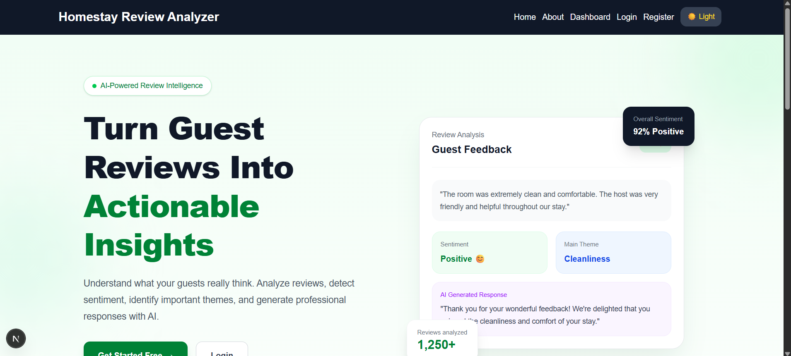
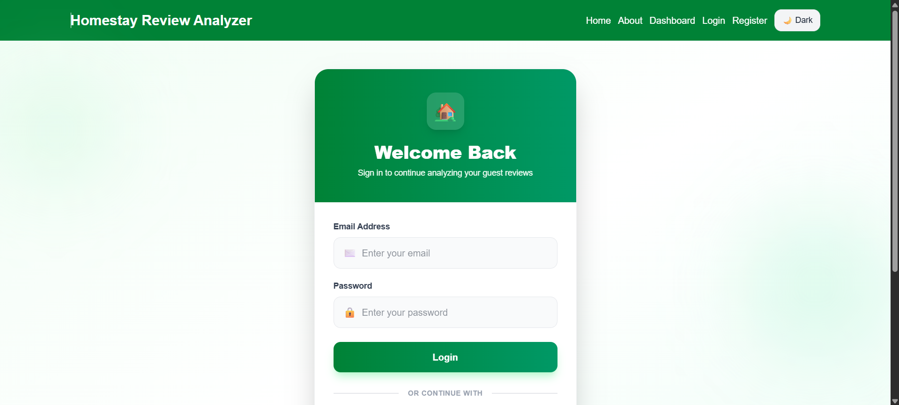
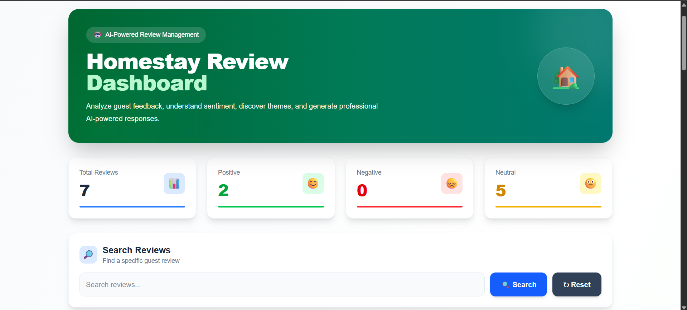
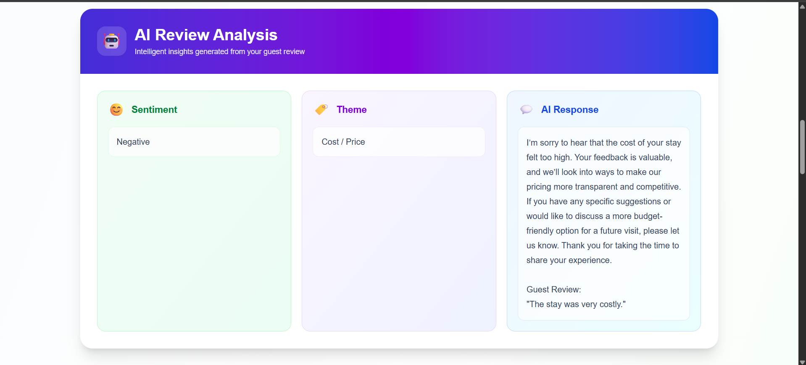

# 🏡 Homestay Review Analyzer

An AI-powered full-stack web application that helps homestay owners analyze guest reviews, identify sentiment and themes, and generate professional AI-based responses.

The application provides authentication, review management, search, sentiment analysis, AI-powered review analysis, and persistent storage using MongoDB Atlas.

---

## 🌐 Live Demo

### Frontend

**Vercel:**
https://homestay-review-analyzer.vercel.app

### Backend

**Render:**
https://homestay-review-backend.onrender.com

### GitHub Repository

https://github.com/Ajay-Singh-903/Homestay-Review-Analyzer


# 📸 Screenshots

### Home Page



### Login / Registration



### Dashboard



### AI Review Analysis



> **Note:** Replace the image paths above with the actual screenshot filenames in your repository.

---

# ✨ Features

## 🔐 Authentication

* User registration
* User login
* JWT-based authentication
* Protected dashboard
* Logout functionality
* Google authentication support

## 🏠 Frontend

* Responsive landing page
* Responsive dashboard
* Login page
* Registration page
* About page
* Light / Dark theme
* Search reviews
* Add reviews
* Edit reviews
* Delete reviews
* Toast notifications
* Loading indicators

## 🤖 AI Features

* AI-powered review analysis
* Sentiment detection
* Review theme detection
* AI-generated professional responses
* Review insights for homestay management

## 📊 Dashboard

* Total review count
* Positive review count
* Negative review count
* Neutral review count
* Search functionality
* Review management
* AI analysis results

## 🗄️ Database

* MongoDB Atlas cloud database
* Persistent review storage
* Mongoose ODM
* CRUD operations

---

# 🛠️ Tech Stack

| Category              | Technology                 |
| --------------------- | -------------------------- |
| Frontend              | Next.js 16                 |
| UI                    | React 19                   |
| Styling               | Tailwind CSS v4            |
| Notifications         | React Hot Toast            |
| Backend               | Node.js                    |
| API                   | Express.js                 |
| Authentication        | JWT / NextAuth             |
| Database              | MongoDB Atlas              |
| ODM                   | Mongoose                   |
| AI                    | Hugging Face Inference API |
| Environment Variables | dotenv                     |
| Deployment            | Vercel + Render            |

---

# ⚙️ Setup Instructions

## 1. Clone the Repository

```bash
git clone https://github.com/Ajay-Singh-903/Homestay-Review-Analyzer.git
```

Move into the project directory:

```bash
cd Homestay-Review-Analyzer
```

---

## 2. Install Frontend Dependencies

```bash
npm install
```

---

## 3. Install Backend Dependencies

```bash
cd backend
npm install
```

---

## 4. Configure Backend Environment Variables

Create a `.env` file inside the `backend` directory.

```env
PORT=5000
MONGO_URI=your_mongodb_connection_string
JWT_SECRET=your_jwt_secret
HUGGINGFACE_API_KEY=your_huggingface_api_key
```


---

## 5. Configure Frontend Environment Variables

Create `.env.local` in the frontend project root:

```env
NEXT_PUBLIC_API_URL=http://localhost:5000
```

For the deployed frontend, the value should point to the Render backend:

```env
NEXT_PUBLIC_API_URL=https://homestay-review-backend.onrender.com
```

Next.js client-side environment variables need the `NEXT_PUBLIC_` prefix, and changes to these values require a new deployment/build.

---

## 6. Run Backend

Open Terminal 1:

```bash
cd backend
npm run dev
```

Backend:

```text
http://localhost:5000
```

---

## 7. Run Frontend

Open Terminal 2:

```bash
npm run dev
```

Frontend:

```text
http://localhost:3000
```

---

# 📡 API Documentation

## Authentication

### Register User

```http
POST /api/auth/register
```

Example request:

```json
{
  "name": "John Doe",
  "email": "john@example.com",
  "password": "password123"
}
```

Example response:

```json
{
  "message": "User registered successfully"
}
```

---

### Login User

```http
POST /api/auth/login
```

Example request:

```json
{
  "email": "john@example.com",
  "password": "password123"
}
```

The API returns an authentication token that is used for protected requests.

---

# 📝 Review APIs

### Get All Reviews

```http
GET /api/reviews
```

Returns all reviews belonging to the authenticated user.

---

### Get Review by ID

```http
GET /api/reviews/:id
```

---

### Create Review

```http
POST /api/reviews
```

Example request:

```json
{
  "guestName": "John",
  "review": "The room was clean and the host was very friendly.",
  "sentiment": "Positive",
  "theme": "Cleanliness",
  "response": "Thank you for your wonderful feedback!"
}
```

---

### Update Review

```http
PUT /api/reviews/:id
```

---

### Delete Review

```http
DELETE /api/reviews/:id
```

---

### Search Reviews

```http
GET /api/reviews/search?q=clean
```

---

# 🤖 AI API

### Analyze Review

```http
POST /api/ai/analyze
```

Example request:

```json
{
  "review": "The room was very clean and the host was extremely helpful."
}
```

Example result:

```text
Sentiment: Positive
Theme: Cleanliness / Host

AI Response:
Thank you for your positive feedback. We are happy
that you enjoyed your stay and appreciated our service.
```

---

# 🏗️ Architecture

The application follows a full-stack architecture:

```text
                    ┌──────────────────────┐
                    │      User / Client   │
                    └──────────┬───────────┘
                               │
                               ▼
                    ┌──────────────────────┐
                    │  Next.js Frontend    │
                    │      (Vercel)        │
                    └──────────┬───────────┘
                               │ REST API
                               ▼
                    ┌──────────────────────┐
                    │ Express.js Backend   │
                    │       (Render)       │
                    └───────┬───────┬──────┘
                            │       │
                 ┌──────────┘       └──────────┐
                 ▼                             ▼
       ┌─────────────────┐          ┌──────────────────┐
       │  MongoDB Atlas  │          │ Hugging Face API │
       │    Database     │          │   AI Analysis    │
       └─────────────────┘          └──────────────────┘
```

---

# 📂 Project Structure

```text
Homestay-Review-Analyzer
│
├── src
│   ├── app
│   │   ├── page.js
│   │   ├── login
│   │   ├── register
│   │   ├── dashboard
│   │   └── about
│   │
│   └── components
│       ├── Navbar
│       ├── Footer
│       ├── ProtectedRoute
│       └── ui
│
├── backend
│   ├── controllers
│   ├── middleware
│   ├── models
│   ├── routes
│   ├── config
│   ├── server.js
│   ├── package.json
│   └── .env.example
│
├── public
│   └── images
│
├── package.json
└── README.md
```

---

# 🗄️ Database

## MongoDB Atlas

MongoDB Atlas is used as the cloud database.

### Review Collection

| Field       | Type     |
| ----------- | -------- |
| `_id`       | ObjectId |
| `guestName` | String   |
| `review`    | String   |
| `sentiment` | String   |
| `theme`     | String   |
| `response`  | String   |
| `createdAt` | Date     |
| `updatedAt` | Date     |

### Why MongoDB?

* Flexible document-based structure
* Easy integration with Node.js
* Cloud-hosted database
* Suitable for CRUD applications
* Scalable for future features

---

# 🚀 Deployment

## Frontend — Vercel

The Next.js frontend is deployed using Vercel.

```text
https://homestay-review-analyzer.vercel.app
```

## Backend — Render

The Express.js backend is deployed using Render.

```text
https://homestay-review-backend.onrender.com
```

## Database — MongoDB Atlas

The production database is hosted on MongoDB Atlas.

Vercel supports Git-based deployments for Next.js projects and environment variables can be configured through the project settings.

## Schema Diagram


---
---

# ⚠️ Known Limitations

* Render's free tier may sleep after periods of inactivity.
* The first backend request after a cold start may take some time.
* AI response speed depends on the Hugging Face API.
* Free-tier hosting services may experience occasional cold starts.
* The application currently depends on external AI API availability.
* Advanced analytics and reporting are planned for future versions.

---

# 🔮 Future Improvements

* Advanced AI sentiment analysis
* More detailed NLP-based theme detection
* Review analytics dashboard
* Charts and visual reports
* Review export to PDF/Excel
* User profile management
* Multi-language AI responses
* Advanced priority alert system
* Improved AI recommendations

---

# 🙏 Credits & Acknowledgements

This project was developed as part of the **AI-Assisted Full Stack Web Development Internship**.

### Technologies & Services

* Next.js
* React
* Tailwind CSS
* Node.js
* Express.js
* MongoDB Atlas
* Mongoose
* Hugging Face
* Vercel
* Render

### Development Resources

The project was developed using official documentation, tutorials, debugging resources, and AI-assisted development tools.

Special thanks to the **TBI-GEU Internship Program** for providing the project structure, weekly milestones, and deployment guidance.

---

# 👨‍💻 Author

**Ajay Singh**

AI-Assisted Full Stack Web Development Internship

### Project

**Homestay Review Analyzer**

### Links

* 🌐 [Live Application](https://homestay-review-analyzer.vercel.app)
* 💻 [GitHub Repository](https://github.com/Ajay-Singh-903/Homestay-Review-Analyzer)

