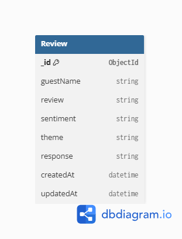

# 🏡 Homestay Review Analyzer

An AI-powered Full Stack Web Application that helps homestay owners analyze guest reviews using sentiment analysis. The application allows users to create, search, update, and delete reviews while storing all data permanently in MongoDB Atlas.

---

# 🚀 Features

## Frontend

- Responsive Landing Page
- Dashboard
- Login Page
- About Page
- Responsive Design
- Dark / Light Mode
- Search Reviews
- Add New Review
- Edit Existing Review
- Delete Review
- Automatic Sentiment Detection
- Toast Notifications
- Loading Indicator

### Reusable Components

- Navbar
- Footer
- Loader
- Toast
- Buttons
- Input Fields

---

## Backend

- RESTful API using Express.js
- Full CRUD Operations
- Search Reviews
- MongoDB Atlas Integration
- Mongoose ODM
- Error Handling Middleware
- Environment Variables with dotenv
- CORS Enabled

---

# 🛠 Tech Stack

## Frontend

- Next.js 16
- React 19
- Tailwind CSS v4
- React Hot Toast

## Backend

- Node.js
- Express.js
- MongoDB Atlas
- Mongoose
- dotenv
- CORS
- Nodemon

---

# 📂 Project Structure

```
my-app
│
├── src
│   ├── app
│   ├── components
│   └── styles
│
├── backend
│   ├── controllers
│   ├── middleware
│   ├── models
│   ├── routes
│   ├── server.js
│   ├── package.json
│   ├── .env.example
│   └── config
│
├── package.json
└── README.md
```

---

# 🗄 Database

### Database Used

MongoDB Atlas

### ODM

Mongoose

### Why MongoDB?

MongoDB was chosen because it provides:

- Flexible document-based schema
- Easy integration with Node.js
- Cloud-hosted free tier using MongoDB Atlas
- Fast CRUD operations
- Scalability for future AI features

---

# 🧩 Database Schema

## Review Collection

| Field | Type |
|-------|------|
| _id | ObjectId |
| guestName | String |
| review | String |
| sentiment | String |
| theme | String |
| response | String |
| createdAt | Date |
| updatedAt | Date |

---

## Schema Diagram

> **Week 5 Deliverable**



---

# ⚙ Backend Setup

Open terminal

```bash
cd backend
```

Install dependencies

```bash
npm install
```

Create a `.env` file

```env
PORT=5000
MONGO_URI=your_mongodb_connection_string
```

Run server

```bash
npm run dev
```

Backend runs on

```
http://localhost:5000
```

---

# 💻 Frontend Setup

Install packages

```bash
npm install
```

Run frontend

```bash
npm run dev
```

Frontend runs on

```
http://localhost:3000
```

---

# 🔑 Environment Variables

Create a `.env` file inside the backend folder.

```env
PORT=5000
MONGO_URI=your_mongodb_connection_string
```

---

# 📡 REST API Endpoints

| Method | Endpoint | Description |
|---------|----------|-------------|
| GET | /api/reviews | Get All Reviews |
| GET | /api/reviews/:id | Get Review by ID |
| POST | /api/reviews | Create Review |
| PUT | /api/reviews/:id | Update Review |
| DELETE | /api/reviews/:id | Delete Review |
| GET | /api/reviews/search?q=keyword | Search Reviews |

---

# ✅ CRUD Functionality

✔ Create Reviews

✔ Read Reviews

✔ Update Reviews

✔ Delete Reviews

✔ Search Reviews

✔ Persistent Storage using MongoDB Atlas

---

# ▶ Run the Project

## Terminal 1

```bash
cd backend
npm install
npm run dev
```

---

## Terminal 2

```bash
npm install
npm run dev
```

---

Open in browser

Frontend

```
http://localhost:3000
```

Backend

```
http://localhost:5000
```

---

# 📸 Screenshots

Add screenshots here

- Home Page
- Dashboard
- CRUD Operations
- Search Feature

---

# 🚀 Future Improvements

- AI-powered Sentiment Analysis using OpenAI
- Theme Detection using NLP
- Authentication & Authorization
- User Profiles
- Dashboard Analytics
- Charts & Reports
- Review Export (PDF/Excel)

---

# 👨‍💻 Author

**Ajay Singh**

AI-Assisted Full Stack Web Development Internship
